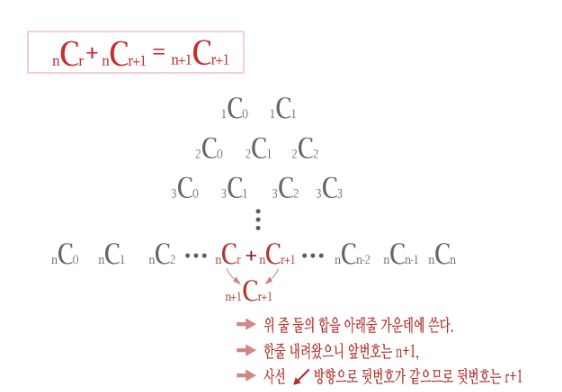

# PS 향유회

# 채팅방 링크

[https://open.kakao.com/o/g3antjMb](https://open.kakao.com/o/g3antjMb)

# 노션 링크

[https://www.notion.so/PS-da8977089c2344dba9bdbc3d0188d286](https://www.notion.so/PS-da8977089c2344dba9bdbc3d0188d286)

# 깃허브 링크

[https://github.com/sesang06/problem-solving-teatime](https://github.com/sesang06/problem-solving-teatime)

- 노션의 미러버전으로, 일이주에 한번 정도만 커밋됩니다.

# 규칙

- 하루에 한문제씩 향유합니다.
- 무슨 문제를 향유할지는 의견이 없으면 제가 제시합니다.
- 의견 제안은 제가 아침에 새로운 향유문제를 올리기 전까지입니다.
- 낮에는 (2시 ~8시) 풀고 인증합니다.
- 어려운 문제가 나왔을 때는, 4시부터 서로 힌트를 주고받습니다.
- 밤 8시 부터 푼 문제의 코드를 공개합니다.

# 항유회를 즐기는 방법

- 점심 시간에 중상급 한 문제를 풀기
- 점심 시간에 중하급 두 문제를 풀기
- 특이한 언어로 중하급 두 문제를 풀기
- 주중에 나온 문제를 주말에 몰아 풀고 올리기

# 뉴비 입문

## 서적

- 종만북
    - [https://book.algospot.com/](https://book.algospot.com/)
- 탑코더 알고리즘 트레이닝
    - [http://m.hanbit.co.kr/store/books/book_view.html?p_code=B9653641350](http://m.hanbit.co.kr/store/books/book_view.html?p_code=B9653641350)

## 사이트

- 그릭포그릭
    - [https://www.geeksforgeeks.org/](https://www.geeksforgeeks.org/)

- 문제집
    - [https://solved.ac/problems/](https://solved.ac/problems/)

### CS 강의

[https://github.com/prakhar1989/awesome-courses#algorithms](https://github.com/prakhar1989/awesome-courses#algorithms)

# 플랫폼

- 중상급 한 문제 : 백준
    - [https://www.acmicpc.net/](https://www.acmicpc.net/)
- 중하급 두 문제 : 릿코드
    - [https://leetcode.com/](https://leetcode.com/)

# 향유문제

### 2020년 2월 29일

- 중하급
    - 프로그래머스, 하샤드 수
        - [https://programmers.co.kr/learn/courses/30/lessons/12947](https://programmers.co.kr/learn/courses/30/lessons/12947)
    - 백준, 부등호
        - [https://www.acmicpc.net/problem/2529](https://www.acmicpc.net/problem/2529)
- 중상급
    - 백준, n포커
        - [https://www.acmicpc.net/problem/16565](https://www.acmicpc.net/problem/16565)

### 2020년 2월 28일

- 중하급
    - 프로그래머스, 모의고사
        - [https://programmers.co.kr/learn/courses/30/lessons/42840](https://programmers.co.kr/learn/courses/30/lessons/42840)
- 중상급
    - 백준, 리그 오브 레전설 (Large)
        - [https://www.acmicpc.net/problem/17272](https://www.acmicpc.net/problem/17272)
    - 백준, 경찰차
        - [https://www.acmicpc.net/problem/2618](https://www.acmicpc.net/problem/2618)
        - 풀이
            - [http://boj.kr/c189a60da9c64581915fade658b118f2](http://boj.kr/c189a60da9c64581915fade658b118f2)
            - DP[I][J] : 현재 1번째 차량의 위치가 I, 2번째 차량의 위치가 J일 때 움직임의 최소값
            - 0,0 부터 w,w 까지 차례대로 다음 최소값을 계산하여 갱신한다.
            - DP[I][J] 의 값을 기반으로, 다음 값을 계산할 수 있다.
            다음 이동해야 하는 곳은 I와 J 중 큰 것에서 +1 한 것이다.
            - (다음 이동값) 에 1번 차와 2번 차가 이동할 경우를 모두 생각하며 값을 갱신한다.
            - max(i,j) + 1 = K  이라 할 때, DP[K][J] = DP[I][J] + (I 와 K 의 거리) , DP[I][K] = DP[I][J] + (J 와 K 의 거리) 이다.
            - 이를 이용하여 dp 를 작성하고 백트래킹한다.

### 2020년 2월 27일

- 중하급
    - 프로그래머스, 2016년
        - [https://programmers.co.kr/learn/courses/30/lessons/12901](https://programmers.co.kr/learn/courses/30/lessons/12901)
- 중상급
    - 백준, 통신망 분할, 유니온 파인드
        - [https://www.acmicpc.net/problem/17398](https://www.acmicpc.net/problem/17398)
        - 풀이
            - [http://boj.kr/3bf5c99a8795496fbbf495fe456dd251](http://boj.kr/3bf5c99a8795496fbbf495fe456dd251)
            - 간선을 자르고 있는 것을 생각하지 말고, 다 잘린 그래프에서 간선을 연결하는 행위라고 생각한다.
            - 최초에 잘리지 않은 쿼리들을 하나씩 이으며 합쳐진 서브 그래프의 크기를 곱해 나간다.
        - 레퍼런스
            - 유니온 파인드
                - [https://twpower.github.io/115-union-find-disjoint-set](https://twpower.github.io/115-union-find-disjoint-set)
    - 백준, Mountain Climbing, 그리디
        - [https://www.acmicpc.net/problem/5910](https://www.acmicpc.net/problem/5910)
            - [http://boj.kr/083f97f3611e42a4bce053386384a27c](http://boj.kr/083f97f3611e42a4bce053386384a27c)
            - Ui < Di 인 것을 A, Ui = Di 인 것을 B, Ui > Di 인 것을 C로 분류한다.
            - A, B, C 순서대로 배치한다.
            - [A 관찰]
                - 두 개만 꺼내서 어떤 순서로 배열하는게 최적인지 생각해 보자.
                - [Ua, Da] , [Ub, Db] 을 생각했을 때
                [Ua, Da] , [Ub, Db]의 값은 Ua + max(Da, Ub) + Db 이다.

                    [Ub, Db], [Ua, Da]의 값은 Ub + max(Db, Ua) + Da 이다.
                     Ua < Ub 인 경우에 대소 관계가 아래 세가지로만 나뉜다.

                    - Ua < Da ≤ Ub < Db
                        - (A가 선행 시) : Ua + Ub + Db
                        - (B가 선행 시) Ub + Db + Da
                        - A가 선행하는 게 항등적으로 최적이다.
                    - Ua ≤ Ub ≤ Da < Db
                        - (A가 선행 시) : Ua + Da + Db
                        - (A가 선행 시) : Ub + Db + Da
                        - A가 선행하는 게 항등적으로 최적이다.
                    - Ua ≤ Ub < Db ≤ Da
                        - (A가 선행 시) : Ua + Da + Db
                        - (B가 선행 시) :  Ub + Db + Da
                        - A 가 선행하는 게 항등적으로 최적이다.
                - 모든 경우에 A가 선행하는 게 항등적으로 이득이다. 따라서 여러 개의 A들을 가상으로 계속.. 버블 정렬 형식으로 최적화를 시키면...
                - Ui에 대해서 오름차순으로 배치하는 게 최적이다.
                - 비슷한 방식으로 A 다음에 B, C 를 배치하고. 비슷한 논리로 관찰하면..
                - C의 경우 Di 에 대하여 내림차순으로 배치하는 게 최적이다.
                - 이런 배치간격을 썼을 경우, 값은 max( minUi + sumOfDi, minDi + sumOfUi ) 이 정답이다.

### 2020년 2월 25일

- 중하급
    - 백준, coci 2010, 대회 or 인턴
        - [https://www.acmicpc.net/problem/2875](https://www.acmicpc.net/problem/2875)
- 중상급
    - 백준, coci 2015, SLON
        - [https://www.acmicpc.net/problem/11775](https://www.acmicpc.net/problem/11775)

### 2020년 2월 24일

- 중하급
    - 프로그래머스, n개의 최소공배수
        - [https://programmers.co.kr/learn/courses/30/lessons/12953](https://programmers.co.kr/learn/courses/30/lessons/12953)
- 중상급
    - 백준, 코드잼, Hiking Raindeer(small)
        - [https://www.acmicpc.net/problem/12157](https://www.acmicpc.net/problem/12157)

### 2020년 2월 22일

- 중하급
    - 프로그래머스, DFS/BFS, 네트워크
        - [https://programmers.co.kr/learn/courses/30/lessons/43162](https://programmers.co.kr/learn/courses/30/lessons/43162)
- 중상급
    - 백준, coci 2015, DFS/BFS, MOLEKULE
        - [https://www.acmicpc.net/problem/11774](https://www.acmicpc.net/problem/11774)

### 2020년 2월 21일

- 중하급
    - 프로그래머스, DFS, BFS, 타겟 넘버
        - [https://programmers.co.kr/learn/courses/30/lessons/43165](https://programmers.co.kr/learn/courses/30/lessons/43165)
- 중상급
    - 백준, ICPC 유럽 지역, BAPC, KEEP HIM INSIDE
        - [https://www.acmicpc.net/problem/17792](https://www.acmicpc.net/problem/17792)

### 2020년 2월 20일

- 중하급
    - 프로그래머스, 스택/큐, 프린터
        - [https://programmers.co.kr/learn/courses/30/lessons/42587](https://programmers.co.kr/learn/courses/30/lessons/42587)
- 중상급
    - 백준, coci 2008, 이분 탐색, 동물원 확장
        - [https://www.acmicpc.net/problem/2962](https://www.acmicpc.net/problem/2962)
        - 풀이
        - [http://boj.kr/6d3f3ae9bf154eff836d4b2c5b927006](http://boj.kr/6d3f3ae9bf154eff836d4b2c5b927006)
        - 시간이 10^9 이므로, O(T) 에 탐색하기 어렵다. 이분 탐색으로 공략한다.
        - 첫 번째 종이 코코넛을 따는 시간을 X 라고 하자. 그러면 두 번째 종이 코코넛을 여는 시간은 T-X가 될 것이다.
        - 각각의 원숭이는 100마리 이하므로, X 시간동안 수집할 수 있는 코코넛의 수를 계산하는 시간 복잡도는 O(100)이다.
        - X가 크면, 따는 코코넛의 수가 증가할 것이고, 반대로 여는 코코넛의 수가 감소할 것이다.
        - X 시간 기준 (따는 수)와 (여는 수)를 비교한다. 서로 같으면 탐색을 끝나고, 따는 수가 크면 X를 줄이고, 여는 수가 크면 X를 늘린다.
        - ... 만 이렇게만 하면 WA 가 뜬다! 굳이 (따는 수)와 (여는 수) 가 같을 필요가 없다.  ([https://www.acmicpc.net/board/view/24924](https://www.acmicpc.net/board/view/24924))
        - X를 비교할 때, 열린 구간 [X-1의 따는 수 + 1, X의 따는 수]와 [(T-X-1)의 여는 수 + 1, (T-X)의 여는 수] 가 교집합이 있기만 하면, X는 답이 된다.
        - 이분 탐색 로직을 수정하여 제출한다 :)

### 2020년 2월 19일

- 중하급
    - 프로그래머스, 완전 탐색, 소수 찾기
        - [https://programmers.co.kr/learn/courses/30/lessons/42839](https://programmers.co.kr/learn/courses/30/lessons/42839)
- 중상급
    - 백준, coci 2015, PIANINO
        - [https://www.acmicpc.net/problem/11924](https://www.acmicpc.net/problem/11924)
        - 풀이
            - [http://boj.kr/8893f62e23dd4c81bdd591ec8c891519](http://boj.kr/8893f62e23dd4c81bdd591ec8c891519)
            - 건반의 증감으로만 감지하므로, 첫 번째 건반을 0으로만 맞추면 명확히 관찰할 수 있다. 예 ) 2 1 -6 -2 1 6 10 → 0 -1 -8 -4 -1 4 8
            - 건반의 증감에 따른 밀카의 연주 음색을 구한다. 예)  0 -1 -8 -4 -1 4 8 의 경우 0 -1 -2 -1 0 1 2
            - 예시의 답안 K=4 가 맞춘 건반을 보면, (-8, -2) (-4, -1)  (4, 1) (8, 2) 로 건반의 증감 / 밀카의 증감 = 4 임을 알 수 있다.
            - 이를 바탕으로 인사이트를 얻어, (건반의 증감) / (밀카의 증감) 값을 모두 세서, 가장 많이 등장하는 값을 리턴한다.

### 2020년 2월 18일

- 중하급
    - 프로그래머스, 그리디, 큰 수 만들기
        - [https://programmers.co.kr/learn/courses/30/lessons/42883](https://programmers.co.kr/learn/courses/30/lessons/42883)
- 중상급
    - 백준, KOI 지역본선 2004, 플로이드-와샬, 회의준비
        - [https://www.acmicpc.net/problem/2610](https://www.acmicpc.net/problem/2610)
        - [http://boj.kr/0a4f2cee676643718a1d6eb674b06eb1](http://boj.kr/0a4f2cee676643718a1d6eb674b06eb1)
            - DFS, BFS 로 서로 연결되어 있는 인원들을 묶어 위원회 아이디를 부여한다.
            - 각각의 위원회 아이디마다 플로이드-와샬로 사람당 걸리는 경로를 구한다.
            - 각각의 사람마다 거리의 최대값을 구해, 그것의 최소값들을 모은다.
            - 회의장들을 정렬하여 출력한다.

### 2020년 2월 16, 17일

- 중하급
    - 프로그래머스, 스택/큐, 기능개발
        - [https://programmers.co.kr/learn/courses/30/lessons/42586](https://programmers.co.kr/learn/courses/30/lessons/42586)
- 중상급
    - 백준, coci 2015, 홍수
    - [https://www.acmicpc.net/problem/11877](https://www.acmicpc.net/problem/11877)

### 2020년 2월 15일

- 중하급
    - 프로그래머스, 해시, 위장
    - [https://programmers.co.kr/learn/courses/30/lessons/42578](https://programmers.co.kr/learn/courses/30/lessons/42578)
- 중상급
    - 백준, coci 2015, PERICA
    - [https://www.acmicpc.net/problem/11876](https://www.acmicpc.net/problem/11876)
        - 풀이
        - [https://www.acmicpc.net/source/share/eeded2c1326546809068322fbccee8ba](https://www.acmicpc.net/source/share/eeded2c1326546809068322fbccee8ba)
        - 오름차순으로 키들을 정렬한다.
        - k=3 일 때, 3번째 키가 출력되는 경우는 2C2이다.
        - k=3일 때, 5번째 키가 출력되는 경우는 4C2이다.
        - i번째 키가 출력되는 경우는 (i-1)C(k-1)이다.
        - 짧은 시간 안에 nCk 집합을 구하는 문제로 전환된다.
            - 파스칼의 삼각형 O(NK)

            
          
            - 페르마의 소정리 O(N * logP)
                - [https://jason9319.tistory.com/169](https://jason9319.tistory.com/169)

### 2020년 2월 14일

- 중하급
    - [https://programmers.co.kr/learn/courses/30/lessons/42862](https://programmers.co.kr/learn/courses/30/lessons/42862)
- 중상급
    - [https://www.acmicpc.net/problem/3017](https://www.acmicpc.net/problem/3017)
        - 풀이
        - [http://boj.kr/37e67d5ecef14532b44c86141beec84c](http://boj.kr/37e67d5ecef14532b44c86141beec84c)
        - b에 0부터 9까지 각각 몇 개 들어가 있는지 저장한다.
        - (a보다 크거나 같은 수 구하기)
            - a를 높은 자리수부터 찾아가면서, 최대한 일치하게끔 값을 맞춘다.
            - 더 이상 일치할 수 없을 때,
                - 그 자리수보다 큰 수를 가져올 수 있으면 일단 그것을 가져온다. 
                예 ) 12340, 12360은 10의 자리에서 불일치하게 된다. 0, 6을 쓸 수 있는데, 6을 가져올 수 있다.
                    - 그 이후로는 가장 작은 자리수 순서대로 정렬하면서 가져온다.
                - 그 자리수보다 큰 수를 가져올 수 없으면, 기존에 일치하도록 맞추었던 것을 하나씩 복원하면서, 그 자리수 대신 큰 수를 가져올 수 있으면 그것을 가져온다.
                    - 예) 32140, 32122 는 321 에서 불일치하지만, 남은 2, 2 로는 십의 자리 '4'보다 크지 않다.
                    따라서 32 까지로 복원하면, 1, 2 , 2 로 되돌아간다. 여기서 2는 백의 자리 '1' 보다 크므로, 끼워맞출 수 있다.
                    - 그 이후로는 가장 작은 자리수 순서대로 정렬하면서 가져온다.
        - (a보다 작은 수 구하기)
            - 위와 아이디어는 동일하지만, 1의 자리까지 끝까지 자리수가 일치할 경우가 추가된다.
                - 그 경우, 하나씩 맞추었던 것을 복원하면서, 그 자리수 대신 작은 수를 가져올 수 있으면 그것을 가져온다.
                - 예) 123, 123 은 1의 자리까지 일치한다. 그러므로 
                1, 1 까지로 되돌린다. 남은 수는 2, 3이다. 여기서 3은 백의 자리 '2' 보다 크므로, 끼워맞출 수 있다.
                - 그 이후로는 가장 큰 자리수 순서대로 정렬하면서 가져온다.

### 2020년 2월 13일

- 중하급
    - [https://programmers.co.kr/learn/courses/30/lessons/42840](https://programmers.co.kr/learn/courses/30/lessons/42840)
- 중상급
    - [https://www.acmicpc.net/problem/12154](https://www.acmicpc.net/problem/12154)

### 2020년 2월 12일

- 중하급
    - [https://programmers.co.kr/learn/courses/30/lessons/42583](https://programmers.co.kr/learn/courses/30/lessons/42583)
- 중상급
    - [https://www.acmicpc.net/problem/2672](https://www.acmicpc.net/problem/2672)
        - 풀이
            - [http://boj.kr/cb10a018a71b430d99f3ed58cd906b3a](http://boj.kr/cb10a018a71b430d99f3ed58cd906b3a)
            - 플레인 스위핑 알고리즘 O(nlogn)
                - 세그먼트 트리를 이용해 최소계산으로 푸는 방법이다.
                    - [https://codedoc.tistory.com/421](https://codedoc.tistory.com/421)
            - 전체 영역 분할 탐색 O(n^3)

                
                

                입력받은 전체 사각형들이 이루는 선분들을 늘려서, 

                바둑판 형식으로 만든다. 

                각 바둑판 조각들, 대략 4n^2 개를 순회하면서,

                n 개의 사각형 중 그 영역을 포함하는 사각형이 있는지 판단한다.

                포함하는 영역들은 넓이를 더해 반환한다.

        - 입출력에 주의
            - 출력 조건을 정확히 지키지 않으면 WA이다.
            - 예시
                - 100.00 (X) 100 (O)
                - 100.1 (X) 100.10 (O)
                - 100.12 (O)

### 2020년 2월 11일

- 중하급
    - [https://programmers.co.kr/learn/courses/30/lessons/42626](https://programmers.co.kr/learn/courses/30/lessons/42626)
- 중상급
    - [https://www.acmicpc.net/problem/3111](https://www.acmicpc.net/problem/3111)

### 2020년 2월 10일

- 중하급
    - [https://programmers.co.kr/learn/courses/30/lessons/12899](https://programmers.co.kr/learn/courses/30/lessons/12899)
- 중상급
    - [https://www.acmicpc.net/problem/17071](https://www.acmicpc.net/problem/17071)
        - 풀이
            - [http://boj.kr/e87ad2576f3b4448829285e3a32b0c6c](http://boj.kr/e87ad2576f3b4448829285e3a32b0c6c)
            - 수빈이가 0부터 500000... 까지 모든 자리에서 최소 몇 번만에 갈 수 있는지 생각한다.
            - 만약 5번 만에 갈 수 있다면, x+1, x-1 이동을 반복하여 5번, 7번, 9번.. 등에 항상 방문할 수 있다.
            - 만약 4번 만에 갈 수 있다면, 4번, 6번, 8번... 만에 갈 수 있다.
            - 따라서 BFS 로 각 자리마다 최소로 도달할 수 있는 짝수번, 홀수번을 전탐색하여 저장한다.
            - 동생의 시간당 위치마다, 그 시간의 짝홀에 따라서 수빈이의 최소 짝/홀 도달 횟수보다 크거나 같은지 확인한다.

### 2020년 2월 9일

- 중하급
    - [https://programmers.co.kr/learn/courses/30/lessons/42747](https://programmers.co.kr/learn/courses/30/lessons/42747)
- 중상급
    - [https://www.acmicpc.net/problem/2488](https://www.acmicpc.net/problem/2488)
        - 풀이
        이 문제는 마을 사람들의 몸무게에 대한 정보가 주어졌을 때, 주어진 규칙을 만족
        하면서 줄다리기 값을 최소로 하는 단위 줄 편성을 찾아내는 문제이다. 기본적으로
        모든 경우를 다 시도하는 방법을 시도하되, 이를 효율적으로 수행하는 것이 문제의
        핵심이다. 먼저 수열을 이루는 값이 20 이상의 정수이고, 차이가 50 이하여야 한다는 조건을
        생각해 보면, A 수열의 첫 구간이 결정되면 B 수열의 첫 구간의 범위는 최대 여섯
        가지 중 하나로 결정되어야 함을 알 수 있다. 이렇게 첫 번째 구간을 결정하는 경
        우의 수는 많아야 6×N가지이고, 첫 번째 구간이 결정되면 각 수열의 두 번째 구간
        을 결정하는 경우의 수도 6×N가지이므로 O(6*N)에 모든 경우를 계산해 낼 수 있
        다. 하지만 이러한 방법만으로는 모든 데이터에 대해서 제한 시간 내에 답을 낼 수
        없다. 이를 조금 개선하면 시간복잡도를 O(N)으로 줄일 수 있다. 첫 구간을 결정하는
        6×N가지 경우 중에서 (A수열의 첫 구간) - (B수열의 첫 구간)값이 같은 경우에는
        구간에 들어가는 수의 개수가 가장 적은 것 하나만 고려해 주면 되는데, 나머지 수
        를 두 번째 구간에 넣는다고 하면 같은 결과가 나기 때문이다. 따라서 많아야 100
        가지 경우만을 추려 낼 수 있고, 각각에 대해서 두 번째 구간을 6×N가지 경우에 대
        해 보면서 결정하면 O(N)의 시간복잡도에 문제를 해결할 수 있다.

# 구글 코드 잼 :)

구글 코드잼의 등록이 2020년 3월 3일부터 열립니다 :) 예선은 통과하도록 화이팅해 봅시다.

[https://codingcompetitions.withgoogle.com/codejam/schedule](https://codingcompetitions.withgoogle.com/codejam/schedule)

### 2020년 2월 7일, 8일

- 중하급
    - [https://programmers.co.kr/learn/courses/30/lessons/42576](https://programmers.co.kr/learn/courses/30/lessons/42576)
        - 풀이
            - [https://sas-study.tistory.com/2](https://sas-study.tistory.com/2)
    - [https://programmers.co.kr/learn/courses/30/lessons/42584](https://programmers.co.kr/learn/courses/30/lessons/42584)
        - 풀이
            - [https://sas-study.tistory.com/256](https://sas-study.tistory.com/256)
- 중상급
    - [https://www.acmicpc.net/problem/12169](https://www.acmicpc.net/problem/12169)
    - 풀이
        - [http://boj.kr/309e7c0362744abebd0521396639a0e0](http://boj.kr/309e7c0362744abebd0521396639a0e0)
        - 해당 코드잼에서 가장 어려웠던 문제 :(
        - [https://code.google.com/codejam/contest/6224486/dashboard#s=a&a=1](https://code.google.com/codejam/contest/6224486/dashboard#s=a&a=1)
        - <먹기, 옮기기> 와 <옮기기, 먹기> 전략 중, 항상 <옮기기, 먹기> 전략이 최적이다.
        - 따라서 전부 옮긴 뒤 먹는 것이 최적이다.
        - [15, 17] → [5, 17, 10] → [5, 17, 7, 3] (별로) 
        [15, 17] → [8, 17, 7] → [4, 17, 7, 3] (더 최적)
        - [9] → [5, 4] (별로)
        [9] → [6, 3] → [3, 3, 3] (더 최적)
        - 옮기기를 마치고 x분 후에 식사를 끝내는 전략은, 
        최초 팬케이크들을 적절히 옮겨서 모든 팬케이크가 x개 이하로 맞추는 전략과 동일하다.
        - x 케이크를 남기기 위해서, Pi 케이크는 M(Pi) = ceil(Pi/x) -1  번 분배시켜야 한다.
        - M(Pi)의 합이 최소가 되는 x를 구한다.

### 2020년 2월 6일

- 중하급
    - [https://www.acmicpc.net/problem/11047](https://www.acmicpc.net/problem/11047)
    - [https://leetcode.com/problems/two-city-scheduling/](https://leetcode.com/problems/two-city-scheduling/)
- 중상급
    - [https://www.acmicpc.net/problem/15422](https://www.acmicpc.net/problem/15422)
    - 풀이
        - 다익스트라 문제, 일반적인 다익스트라는 {거리, 인덱스} 를 큐에 집어넣는다면, 이 문제는 {거리, 인덱스, 비행기 이용 여부} 를 큐에 집어 넣는다.
        - 다음 최단 거리를 통할 때, 비행기를 향해 간다면,
            - 비행기를 이미 이용했을 경우 갱신하지 않는다.
            - 비행기를 이용하지 않았을 경우 {거리, 인덱스, true} 를 큐에 넣는다.
        - [http://boj.kr/8e70ff08c58d4599b0f33b62267b3d11](http://boj.kr/8e70ff08c58d4599b0f33b62267b3d11)

### 2020년 2월 5일

구글 코드잼 예선 :)

- 중하급
    - [https://www.acmicpc.net/problem/14788](https://www.acmicpc.net/problem/14788)
- 중상급
    - [https://www.acmicpc.net/problem/14793](https://www.acmicpc.net/problem/14793)
    - 풀이
        - [https://www.youtube.com/watch?v=Y7GGwEKFboA](https://www.youtube.com/watch?v=Y7GGwEKFboA)
        - 화장실을 하나의 구간으로 보고, 이용한 화장실을 기준으로 구간을 계속 잘라간다고 생각한다.
        - 우선순위 큐에 현재 비어 있는 연속된 화장실의 구간을 집어 넣는다. 예를 들어, 처음에는 {0, n} 을 집어 넣는다.
        - 큐에서 꺼내서, 정중앙을 뺀 나머지 두 구간으로 만든 뒤 다시 큐에 넣는 작업을 반복한다. 예를 들어, {0, n} 을 빼서 {0, n/2}, {n/2 + 1, 0} 을 집어 넣는다.

### 2020년 2월 4일

- 중하급
    - [https://www.acmicpc.net/problem/2798](https://www.acmicpc.net/problem/2798)
    - [https://www.acmicpc.net/problem/2231](https://www.acmicpc.net/problem/2231)
- 중상급
    - [https://www.acmicpc.net/problem/3015](https://www.acmicpc.net/problem/3015)
    - 풀이
        - [https://sesang06.tistory.com/169](https://sesang06.tistory.com/169)

### 2020년 2월 2, 3일

- 중하급
    - [https://www.acmicpc.net/problem/2562](https://www.acmicpc.net/problem/2562)
    - [https://www.acmicpc.net/problem/1931](https://www.acmicpc.net/problem/1931)
- 중상급
    - [https://www.acmicpc.net/problem/15457](https://www.acmicpc.net/problem/15457)

### 2020년 2월 1일

- 중하급
    - [https://leetcode.com/problems/4sum-ii/](https://leetcode.com/problems/4sum-ii/)
- 중상급
    - [https://www.acmicpc.net/problem/17495](https://www.acmicpc.net/problem/17495)

### 2020년 1월 31일

- 중하급
    - [https://leetcode.com/problems/two-sum/](https://leetcode.com/problems/two-sum/)
- 중상급
    - [https://www.acmicpc.net/problem/15459](https://www.acmicpc.net/problem/15459)

### 2020년 1월 30일

- 중하급
    - [https://leetcode.com/problems/sort-array-by-parity-ii/](https://leetcode.com/problems/sort-array-by-parity-ii/)
- 중상급
    - [https://www.acmicpc.net/problem/15758](https://www.acmicpc.net/problem/15758)

### 2020년 1월 29일

- 중하급
    - [https://www.acmicpc.net/problem/17626](https://www.acmicpc.net/problem/17626)
- 중상급
    - [https://www.acmicpc.net/problem/12013](https://www.acmicpc.net/problem/12013)

### 2020년 1월 28일

- 중하급
    - [https://leetcode.com/problems/range-sum-of-bst/](https://leetcode.com/problems/range-sum-of-bst/)
    - [https://www.acmicpc.net/problem/2739](https://www.acmicpc.net/problem/2739)
- 중상급
    - [https://www.acmicpc.net/problem/1081](https://www.acmicpc.net/problem/1081)

### 2020년 1월 26일

- 중하급
    - [https://www.acmicpc.net/problem/10816](https://www.acmicpc.net/problem/10816)
- 중상급
    - [https://www.acmicpc.net/problem/14637](https://www.acmicpc.net/problem/14637)

    

### 2020년 1월 24일

- 중하급
    - [https://leetcode.com/problems/maximum-69-number/](https://leetcode.com/problems/maximum-69-number/)
- 중상급
    - [https://www.acmicpc.net/problem/1604](https://www.acmicpc.net/problem/1604)

### 2020년 1월 23일

- 중하급
    - [https://leetcode.com/problems/maximum-69-number/](https://leetcode.com/problems/maximum-69-number/)
- 중상급
    - [https://www.acmicpc.net/problem/2637](https://www.acmicpc.net/problem/2637)

### 2020년 1월 22일

- 중하급
    - [https://leetcode.com/problems/combination-sum-ii/](https://leetcode.com/problems/combination-sum-ii/)
- 중상급
    - [https://www.acmicpc.net/problem/17192](https://www.acmicpc.net/problem/17192)

### 2020년 1월 21일

- 중하급
    - [https://leetcode.com/problems/binary-number-with-alternating-bits/](https://leetcode.com/problems/binary-number-with-alternating-bits/)
- 중상급
    - [https://www.acmicpc.net/problem/17612](https://www.acmicpc.net/problem/17612)

### 2020년 1월 20일

- 중하급
    - [https://leetcode.com/problems/target-sum/](https://leetcode.com/problems/target-sum/)
- 중상급
    - [https://www.acmicpc.net/problem/2272](https://www.acmicpc.net/problem/2272)

### 2020년 1월 19일

- 중하급
    - [https://leetcode.com/problems/implement-strstr/](https://leetcode.com/problems/implement-strstr/)
- 중상급
    - [https://www.acmicpc.net/problem/1797](https://www.acmicpc.net/problem/1797)

### 2020년 1월 18일

- 중하급
    - [https://leetcode.com/problems/top-k-frequent-elements/](https://leetcode.com/problems/top-k-frequent-elements/)
- 중상급
    - [https://www.acmicpc.net/problem/2086](https://www.acmicpc.net/problem/2086)

### 2020년 1월 17일

- 중하급
    - [https://leetcode.com/problems/fizz-buzz/](https://leetcode.com/problems/fizz-buzz/)
- 중상급
    - [https://www.acmicpc.net/problem/14743](https://www.acmicpc.net/problem/14743)

### 2020년 1월 15일, 16일

- 중하급
    - [https://leetcode.com/problems/perfect-squares/](https://leetcode.com/problems/perfect-squares/)
- 중상급
    - [https://www.acmicpc.net/problem/17511](https://www.acmicpc.net/problem/17511)

### 2020년 1월 14일

- 중하급
    - [https://www.acmicpc.net/problem/14465](https://www.acmicpc.net/problem/14465)
- 중상급
    - [https://www.acmicpc.net/problem/14462](https://www.acmicpc.net/problem/14462)

### 2020년 1월 13일

- 중하급
    - [https://leetcode.com/problems/is-graph-bipartite/](https://leetcode.com/problems/is-graph-bipartite/)
    - 이분 매칭 (Bipartite Graph) 으로 검색해 주세요.
- 중상급
    - [https://www.acmicpc.net/problem/17834](https://www.acmicpc.net/problem/17834)

### 2020년 1월 12일

- 중하급
    - [https://leetcode.com/problems/permutations/](https://leetcode.com/problems/permutations/)
- 중상급
    - [https://www.acmicpc.net/problem/17505](https://www.acmicpc.net/problem/17505)

### 2020년 1월 11일

휴무 :)

### 2020년 1월 10일

- 중하급
    - [https://leetcode.com/problems/product-of-array-except-self/](https://leetcode.com/problems/product-of-array-except-self/)
- 중상급
    - [https://www.acmicpc.net/problem/17023](https://www.acmicpc.net/problem/17023)

### 2020년 1월 9일

- 중하급
    - [https://leetcode.com/problems/merge-two-sorted-lists/](https://leetcode.com/problems/merge-two-sorted-lists/)
    - [https://leetcode.com/problems/network-delay-time/](https://leetcode.com/problems/network-delay-time/)
- 중상급
    - [https://www.acmicpc.net/problem/1595](https://www.acmicpc.net/problem/1595)

### 2020년 1월 8일

- 중하급
    - [https://leetcode.com/problems/valid-anagram/](https://leetcode.com/problems/valid-anagram/)
- 중상급
    - [https://www.acmicpc.net/problem/17840](https://www.acmicpc.net/problem/17840)

### 2020년 1월 7일

- 중하급
    - [https://leetcode.com/problems/contains-duplicate/](https://leetcode.com/problems/contains-duplicate/)
- 중상급
    - [https://www.acmicpc.net/problem/17240](https://www.acmicpc.net/problem/17240)

### 2020년 1월 6일

- 중하급
    - [https://leetcode.com/problems/n-repeated-element-in-size-2n-array/](https://leetcode.com/problems/n-repeated-element-in-size-2n-array/)
    - [https://leetcode.com/problems/daily-temperatures/](https://leetcode.com/problems/daily-temperatures/)
- 중상급
    - [https://www.acmicpc.net/problem/15877](https://www.acmicpc.net/problem/15877)

### 2020년 1월 5일

- 중하급
    - [https://leetcode.com/problems/maximum-difference-between-node-and-ancestor/](https://leetcode.com/problems/maximum-difference-between-node-and-ancestor/)
- 중상급
    - [https://www.acmicpc.net/problem/14267](https://www.acmicpc.net/problem/14267)

### 2020년 1월 4일

- 중하급
    - [https://leetcode.com/problems/beautiful-array/](https://leetcode.com/problems/beautiful-array/)
- 중상급
    - [https://www.acmicpc.net/problem/14502](https://www.acmicpc.net/problem/14502)

### 2020년 1월 3일

- 중하급
    - [https://leetcode.com/problems/move-zeroes/](https://leetcode.com/problems/move-zeroes/)
- 중상급
    - [https://www.acmicpc.net/problem/13459](https://www.acmicpc.net/problem/13459)

### 2020년 1월 2일

- 중하급
    - [https://leetcode.com/problems/subsets/](https://leetcode.com/problems/subsets/)
- 중상급
    - [https://www.acmicpc.net/problem/1756](https://www.acmicpc.net/problem/1756)

### 2020년 1월 1일

- 중하급
    - [https://leetcode.com/problems/combination-sum/](https://leetcode.com/problems/combination-sum/)
- 중상급
    - [https://www.acmicpc.net/problem/13460](https://www.acmicpc.net/problem/13460)

### 2019년 12월 31일

- 중하급
    - [https://leetcode.com/problems/min-stack/](https://leetcode.com/problems/min-stack/)
- 중상급
    - [https://www.acmicpc.net/problem/18225](https://www.acmicpc.net/problem/18225)

### 2019년 12월 30일

- 중하급
    - [https://leetcode.com/problems/cousins-in-binary-tree/](https://leetcode.com/problems/cousins-in-binary-tree/)
    - [https://leetcode.com/problems/maximum-depth-of-n-ary-tree/](https://leetcode.com/problems/maximum-depth-of-n-ary-tree/)
- 중상급
    - [https://www.acmicpc.net/problem/15999](https://www.acmicpc.net/problem/15999)

### 2019년 12월 29일

- 중하급
    - [https://leetcode.com/problems/best-time-to-buy-and-sell-stock/](https://leetcode.com/problems/best-time-to-buy-and-sell-stock/)
    - [https://leetcode.com/problems/palindromic-substrings/](https://leetcode.com/problems/palindromic-substrings/)
- 중상급
    - [https://www.acmicpc.net/problem/17953](https://www.acmicpc.net/problem/17953)

### 2019년 12월 28일

- 중하급
    - [https://leetcode.com/problems/reverse-linked-list/](https://leetcode.com/problems/reverse-linked-list/)
    - [https://leetcode.com/problems/delete-node-in-a-linked-list/](https://leetcode.com/problems/delete-node-in-a-linked-list/)
- 중상급
    - [https://www.acmicpc.net/problem/17209](https://www.acmicpc.net/problem/17209)

### 2019년 12월 27일

- 중하급
    - [https://leetcode.com/problems/di-string-match/](https://leetcode.com/problems/di-string-match/)
    - [https://leetcode.com/problems/single-number/](https://leetcode.com/problems/single-number/)
- 중상급
    - [https://www.acmicpc.net/problem/17265](https://www.acmicpc.net/problem/17265)

### 2019년 12월 25일, 26일

- 중하급
    - [https://leetcode.com/problems/house-robber/](https://leetcode.com/problems/house-robber/)
    - [https://leetcode.com/problems/fair-candy-swap/](https://leetcode.com/problems/fair-candy-swap/)
- 중상급
    - [https://www.acmicpc.net/problem/17084](https://www.acmicpc.net/problem/17084)

### 2019년 12월 24일

- 중하급
    - [https://leetcode.com/problems/pascals-triangle/](https://leetcode.com/problems/pascals-triangle/)
    - [https://leetcode.com/problems/stone-game/](https://leetcode.com/problems/stone-game/) (미니맥스 알고리즘)
- 중상급
    - [https://www.acmicpc.net/problem/17075](https://www.acmicpc.net/problem/17075)

### 2019년 12월 23일

- 중하급
    - [https://leetcode.com/problems/reverse-string/](https://leetcode.com/problems/reverse-string/)
    - [https://leetcode.com/problems/interval-list-intersections/](https://leetcode.com/problems/interval-list-intersections/)
- 중상급
    - [https://www.acmicpc.net/problem/15678](https://www.acmicpc.net/problem/15678)

### 2019년 12월 22일

- 중하급
    - [https://leetcode.com/problems/evaluate-division/](https://leetcode.com/problems/evaluate-division/)
    - [https://leetcode.com/problems/path-with-maximum-gold/](https://leetcode.com/problems/path-with-maximum-gold/)
- 중상급
    - [https://www.acmicpc.net/problem/17305](https://www.acmicpc.net/problem/17305)

### 2019년 12월 21일

- 중하급
    - [https://leetcode.com/problems/evaluate-division/](https://leetcode.com/problems/evaluate-division/)
    - [https://leetcode.com/problems/path-with-maximum-gold/](https://leetcode.com/problems/path-with-maximum-gold/)
- 중상급
    - [https://www.acmicpc.net/problem/5615](https://www.acmicpc.net/problem/5615)

### 2019년 12월 20일

- 중하급
    - [https://leetcode.com/problems/rotting-oranges/](https://leetcode.com/problems/rotting-oranges/)
    - [https://leetcode.com/problems/max-area-of-island/](https://leetcode.com/problems/max-area-of-island/)
- 중상급
    - [https://www.acmicpc.net/problem/17267](https://www.acmicpc.net/problem/17267)

### 2019년 12월 19일

- 중하급
    - [https://leetcode.com/problems/maximum-subarray/](https://leetcode.com/problems/maximum-subarray/)
    - [https://leetcode.com/problems/k-closest-points-to-origin/](https://leetcode.com/problems/k-closest-points-to-origin/)
- 중상급
    - [https://www.acmicpc.net/problem/16740](https://www.acmicpc.net/problem/16740)

### 2019년 12월 18일

- 중하급
    - [https://leetcode.com/problems/split-a-string-in-balanced-strings/](https://leetcode.com/problems/split-a-string-in-balanced-strings/)
    - [https://leetcode.com/problems/minimum-add-to-make-parentheses-valid/](https://leetcode.com/problems/minimum-add-to-make-parentheses-valid/)
- 중상급
    - [https://www.acmicpc.net/problem/17268](https://www.acmicpc.net/problem/17268)

### 2019년 12월 17일

- 중하급
    - [https://leetcode.com/problems/count-square-submatrices-with-all-ones/](https://leetcode.com/problems/count-square-submatrices-with-all-ones/)
    - [https://leetcode.com/problems/minimum-cost-for-tickets/](https://leetcode.com/problems/minimum-cost-for-tickets/)
- 중상급
    - [https://www.acmicpc.net/problem/15113](https://www.acmicpc.net/problem/15113)

### 2019년 12월 16일

- 중하급
    - [https://www.acmicpc.net/problem/2529](https://www.acmicpc.net/problem/2529)
    - [https://leetcode.com/problems/course-schedule/](https://leetcode.com/problems/course-schedule/)
- 중상급
    - [https://www.acmicpc.net/problem/17492](https://www.acmicpc.net/problem/17492)

### 2019년 12월 15일

- 중하급
    - [https://leetcode.com/problems/find-the-town-judge/](https://leetcode.com/problems/find-the-town-judge/)
    - [https://leetcode.com/problems/is-graph-bipartite/](https://leetcode.com/problems/is-graph-bipartite/)
- 중상급
    - [https://www.acmicpc.net/problem/15791](https://www.acmicpc.net/problem/15791)

### 2019년 12월 14일

- 중하급
    - [https://leetcode.com/problems/flood-fill/](https://leetcode.com/problems/flood-fill/)
    - [https://leetcode.com/problems/pacific-atlantic-water-flow/](https://leetcode.com/problems/pacific-atlantic-water-flow/)
- 중상급
    - [https://www.acmicpc.net/problem/16000](https://www.acmicpc.net/problem/16000)

### 2019년 12월 13일

- 중하급
    - [https://leetcode.com/problems/is-subsequence/](https://leetcode.com/problems/is-subsequence/)
    - [https://leetcode.com/problems/longest-common-subsequence/](https://leetcode.com/problems/longest-common-subsequence/)
- 중상급
    - [https://www.acmicpc.net/problem/14517](https://www.acmicpc.net/problem/14517)

### 2019년 12월 12일

- 중하급
    - [https://leetcode.com/problems/island-perimeter/](https://leetcode.com/problems/island-perimeter/)
    - [https://leetcode.com/problems/fraction-addition-and-subtraction/](https://leetcode.com/problems/fraction-addition-and-subtraction/)
- 중상급
    - [https://www.acmicpc.net/problem/1341](https://www.acmicpc.net/problem/1341)

### 2019년 12월 11일

- 중하급
    - [https://leetcode.com/problems/count-primes/](https://leetcode.com/problems/count-primes/)
    - [https://leetcode.com/problems/fibonacci-number/](https://leetcode.com/problems/fibonacci-number/)
- 중상급
    - [https://www.acmicpc.net/problem/15897](https://www.acmicpc.net/problem/15897)

### 2019년 12월 10일

- 중하급
    - [https://leetcode.com/problems/balanced-binary-tree/](https://leetcode.com/problems/balanced-binary-tree/)
    - [https://leetcode.com/problems/distribute-coins-in-binary-tree/](https://leetcode.com/problems/distribute-coins-in-binary-tree/)
- 중상급
    - [https://www.acmicpc.net/problem/17073](https://www.acmicpc.net/problem/17073)

### 2019년 12월 9일

- 중하급
    - [https://leetcode.com/problems/battleships-in-a-board/](https://leetcode.com/problems/battleships-in-a-board/)
    - [https://leetcode.com/problems/queens-that-can-attack-the-king/](https://leetcode.com/problems/queens-that-can-attack-the-king/)
- 중상급
    - [https://www.acmicpc.net/problem/17455](https://www.acmicpc.net/problem/17455)

### 2019년 12월 8일

- 중하급
    - [https://leetcode.com/problems/regions-cut-by-slashes/](https://leetcode.com/problems/regions-cut-by-slashes/)
    - [https://leetcode.com/problems/partition-labels/](https://leetcode.com/problems/partition-labels/)
- 중상급
    - [https://www.acmicpc.net/problem/17951](https://www.acmicpc.net/problem/17951)

### 2019년 12월 7일

- 중하급
    - [https://leetcode.com/problems/keys-and-rooms/](https://leetcode.com/problems/keys-and-rooms/)
    - [https://leetcode.com/problems/stone-game-ii/](https://leetcode.com/problems/stone-game-ii/)
- 중상급
    - [https://www.acmicpc.net/problem/13261](https://www.acmicpc.net/problem/13261)
    - 지뢰문제

### 2019년 12월 6일

- 중하급
    - [https://leetcode.com/problems/is-subsequence/](https://leetcode.com/problems/is-subsequence/)
    - [https://leetcode.com/problems/minesweeper/](https://leetcode.com/problems/minesweeper/)
- 중상급
    - [https://www.acmicpc.net/problem/11583](https://www.acmicpc.net/problem/11583)

### 2019년 12월 5일

- 중하급
    - [https://leetcode.com/problems/delete-nodes-and-return-forest/](https://leetcode.com/problems/delete-nodes-and-return-forest/)
    - [https://leetcode.com/problems/search-insert-position/](https://leetcode.com/problems/search-insert-position/)
- 중상급
    - [https://www.acmicpc.net/problem/17235](https://www.acmicpc.net/problem/17235)

### 2019년 12월 4일

- 중하급
    - [https://leetcode.com/problems/min-cost-climbing-stairs/](https://leetcode.com/problems/min-cost-climbing-stairs/)
    - [https://leetcode.com/problems/minimum-falling-path-sum/](https://leetcode.com/problems/minimum-falling-path-sum/)
- 중상급
    - [https://www.acmicpc.net/problem/17234](https://www.acmicpc.net/problem/17234)

### 2019년 12월 3일

- 중하급
    - [https://leetcode.com/problems/number-of-closed-islands/](https://leetcode.com/problems/number-of-closed-islands/)
    - [https://leetcode.com/problems/happy-number/](https://leetcode.com/problems/happy-number/)
- 중상급
    - [https://www.acmicpc.net/problem/17453](https://www.acmicpc.net/problem/17453)

### 2019년 12월 2일

- 중하급
    - [https://leetcode.com/problems/letter-tile-possibilities/](https://leetcode.com/problems/letter-tile-possibilities/)
    - [https://leetcode.com/problems/greatest-common-divisor-of-strings/](https://leetcode.com/problems/greatest-common-divisor-of-strings/)
- 중상급
    - [https://www.acmicpc.net/problem/17370](https://www.acmicpc.net/problem/17370)

### 2019년 12월 1일

- 중하급
    - [https://leetcode.com/problems/climbing-stairs/](https://leetcode.com/problems/climbing-stairs/)
    - [https://leetcode.com/problems/majority-element/](https://leetcode.com/problems/majority-element/)
- 중상급
    - [https://www.acmicpc.net/problem/16681](https://www.acmicpc.net/problem/16681)

### 2019년 11월 30일

- 중하급
    - [https://leetcode.com/problems/middle-of-the-linked-list/](https://leetcode.com/problems/middle-of-the-linked-list/)
    - [https://leetcode.com/problems/minimum-absolute-difference/](https://leetcode.com/problems/minimum-absolute-difference/)
- 중상급
    - [https://www.acmicpc.net/problem/16674](https://www.acmicpc.net/problem/16674)

### 2019년 11월 29일

- 중하급
    - [https://leetcode.com/problems/n-ary-tree-preorder-traversal/](https://leetcode.com/problems/n-ary-tree-preorder-traversal/)
    - [https://leetcode.com/problems/find-common-characters/](https://leetcode.com/problems/find-common-characters/)
- 중상급
    - [https://www.acmicpc.net/problem/16682](https://www.acmicpc.net/problem/16682)

### 2019년 11월 28일

- 중하급
    - [https://leetcode.com/problems/merge-two-binary-trees/](https://leetcode.com/problems/merge-two-binary-trees/)
    - [https://leetcode.com/problems/number-of-recent-calls/](https://leetcode.com/problems/number-of-recent-calls/)
- 중상급
    - [https://www.acmicpc.net/problem/16678](https://www.acmicpc.net/problem/16678)

### 2019년 11월 27일

- 중하급
    - [https://leetcode.com/problems/array-partition-i/](https://leetcode.com/problems/array-partition-i/)
    - [https://leetcode.com/problems/hamming-distance/](https://leetcode.com/problems/hamming-distance/)
- 중상급
    - [https://www.acmicpc.net/problem/16677](https://www.acmicpc.net/problem/16677)

### 2019년 11월 26일

- 중하급
    - [https://leetcode.com/problems/unique-morse-code-words/](https://leetcode.com/problems/unique-morse-code-words/)
    - [https://leetcode.com/problems/self-dividing-numbers/](https://leetcode.com/problems/self-dividing-numbers/)
- 중상급
    - [https://www.acmicpc.net/problem/12846](https://www.acmicpc.net/problem/12846)

### 2019년 11월 25일

- 중하급
    - [https://leetcode.com/problems/remove-outermost-parentheses/](https://leetcode.com/problems/remove-outermost-parentheses/)
    - [https://leetcode.com/problems/robot-return-to-origin/](https://leetcode.com/problems/robot-return-to-origin/)
- 중상급
    - [https://www.acmicpc.net/problem/14618](https://www.acmicpc.net/problem/14618)

### 2019년 11월 24일

- 중하급
    - [https://leetcode.com/problems/to-lower-case/](https://leetcode.com/problems/to-lower-case/)
    - [https://leetcode.com/problems/cells-with-odd-values-in-a-matrix/](https://leetcode.com/problems/cells-with-odd-values-in-a-matrix/)
- 중상급
    - [https://www.acmicpc.net/problem/14619](https://www.acmicpc.net/problem/14619)

### 2019년 11월 23일

- [https://www.acmicpc.net/problem/14620](https://www.acmicpc.net/problem/14620)
    - 중급
    - #백트래킹 #브루트 포스 #DFS #BFS

### 2019년 11월 22일

- [https://www.acmicpc.net/problem/14612](https://www.acmicpc.net/problem/14612)
    - 중상급
    - #그래프 #연결 리스트 #다익스트라 #DFS

### 2019년 11월 21일

- [https://www.acmicpc.net/problem/14612](https://www.acmicpc.net/problem/14612)
    - 중급
    - #배열 #정렬 #우선순위 큐 #자료구조